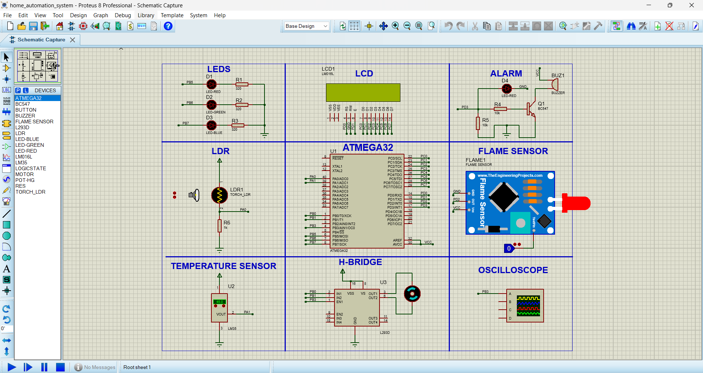
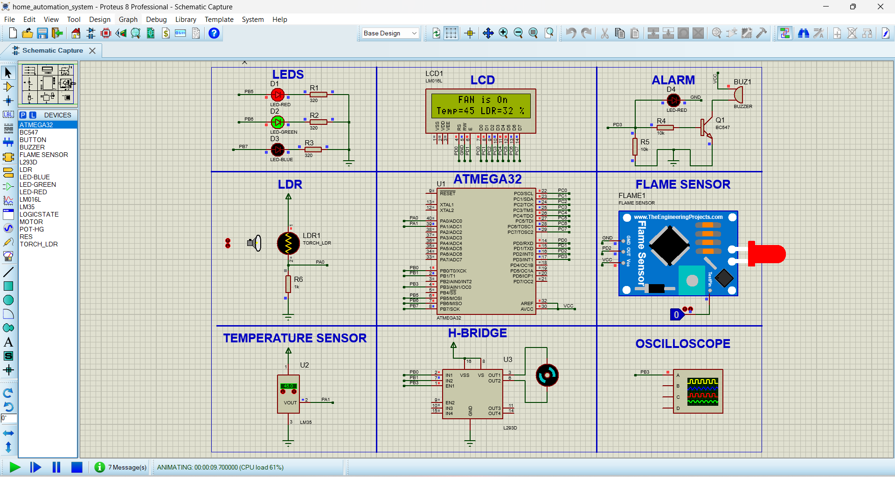

# Smart Home Automation System
This project implements a smart home automation system using ATmega32 microcontroller that automatically controls lighting and fan speed based on environmental conditions. The system includes fire detection capabilities with critical alerts.

## Features

- **Automatic Lighting Control**: 
  - Controls three LEDs based on ambient light intensity from LDR
  - Intensity < 15%: All LEDs ON
  - Intensity 16-50%: Red & Green LEDs ON
  - Intensity 51-70%: Only Red LED ON
  - Intensity > 70%: All LEDs OFF

- **Intelligent Fan Control**:
  - Adjusts fan speed proportionally to temperature
  - Temperature ≥ 40°C: Fan at 100% speed
  - 35-39°C: Fan at 75% speed
  - 30-34°C: Fan at 50% speed
  - 25-29°C: Fan at 25% speed
  - <25°C: Fan OFF

- **Fire Detection & Alert**:
  - Flame sensor detects fire hazards
  - Activates buzzer alarm
  - Displays "Critical alert!" on LCD
  - System remains in alert mode until flame is cleared

- **Real-time Monitoring**:
  - LCD displays current temperature and light intensity
  - Shows fan status (ON/OFF)

## Hardware Components

| Component         | Connection               |
|-------------------|--------------------------|
| Microcontroller   | ATmega32                 |
| Temperature Sensor| LM35 (PA1, ADC Channel 1)|
| Light Sensor      | LDR (PA0, ADC Channel 0) |
| Flame Sensor      | PD2                      |
| LCD (16x2)        | RS: PD0, E: PD1, Data: PORTC |
| Motor Control     | IN1: PB0, IN2: PB1, EN: PB3/OC0 |
| Red LED           | PB5                      |
| Green LED         | PB6                      |
| Blue LED          | PB7                      |
| Buzzer            | PD3                      |

## Project Structure

The system follows a layered architecture:

```
Application Layer (main.c)
  ↓
Hardware Abstraction Layer (LCD, LED, Buzzer, Motor, Flame, LM35, LDR)
  ↓
MCAL Layer (GPIO, PWM, ADC)
  ↓
Microcontroller (ATmega32)
```

### Key Source Files

| File               | Description                          |
|--------------------|--------------------------------------|
| `main.c`           | Main application logic               |
| `adc.[c/h]`        | Analog-to-Digital Converter driver   |
| `pwm.[c/h]`        | PWM generation for motor control     |
| `lcd.[c/h]`        | 16x2 LCD display driver              |
| `lm35_sensor.[c/h]`| Temperature sensor interface         |
| `ldr.[c/h]`        | Light sensor interface               |
| `flame_sensor.[c/h]`| Flame detection module              |
| `motor.[c/h]`      | DC motor control driver              |
| `led.[c/h]`        | LED control module                   |
| `buzzer.[c/h]`     | Buzzer alarm control                 |
| `gpio.[c/h]`       | GPIO pin configuration               |

## How It Works

1. **System Initialization**:
   - Configures ADC for sensor readings
   - Initializes LCD display
   - Sets up PWM for motor control
   - Configures GPIO pins for I/O devices

2. **Sensor Monitoring**:
   - Continuously reads temperature from LM35
   - Measures ambient light with LDR
   - Monitors flame sensor for fire detection

3. **Automatic Control**:
   ```c
   // Example control logic (simplified)
   void update_system_state() {
     // Read sensors
     uint8 temp = LM35_getTemperature();
     uint8 ldr_value = LDR_getPercentage();
     
     // Control fan based on temperature
     if(temp >= 40) PWM_setDutyCycle(255);  // 100% speed
     else if(temp >= 35) PWM_setDutyCycle(191); // 75% speed
     // ... additional temperature ranges
     
     // Control LEDs based on light intensity
     if(ldr_value < 15) LED_allOn();
     else if(ldr_value < 50) LED_redGreenOn();
     // ... additional intensity ranges
     
     // Check flame sensor
     if(FLAME_read()) handle_fire_alert();
   }
   ```

4. **Alert Handling**:
   - When flame detected:
     - Activates buzzer
     - Displays critical alert on LCD
     - Halts normal operation until fire cleared

## Getting Started

### Prerequisites
- Proteus 8 Professional (for simulation)
- AVR Toolchain (AVR-GCC, AVR-Libc)
- Programmer (USBasp, AVRDUDE)

### Running the Simulation
1. Open `home_automation_system.pdsprj` in Proteus
2. Build the project using the provided source files
3. Program the ATmega32 microcontroller
4. Run the simulation and observe system behavior

### Customization
To adjust thresholds (temperature ranges, light levels), modify these constants in `main.c`:
```c
// Temperature thresholds (°C)
#define TEMP_HIGH 40
#define TEMP_MED_HIGH 35
#define TEMP_MED 30
#define TEMP_LOW 25

// Light intensity thresholds (%)
#define LIGHT_HIGH 70
#define LIGHT_MED 50
#define LIGHT_LOW 15
```

## Circuit Diagram



## Future Enhancements
- Add Bluetooth/WiFi connectivity for remote monitoring
- Implement energy consumption tracking
- Add security features (door/window sensors)
- Integrate humidity control
- Develop mobile app dashboard

## License
This project is licensed under the MIT License - see the [LICENSE](LICENSE) file for details.

---
## Author  
*Ahmed Alaa*  
*Contact: ahmedgafer06@gmail.com*